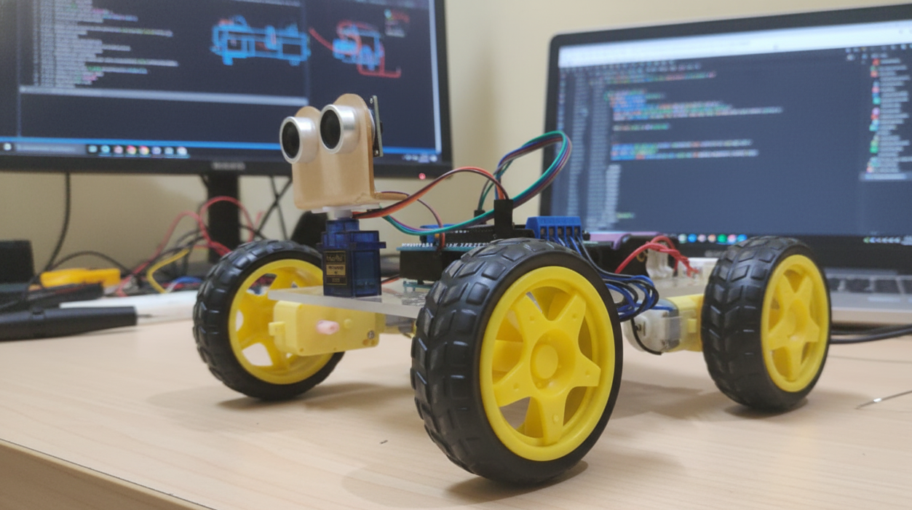

# 🚗 Arduino-Based Obstacle Avoidance Car

  
  

A working prototype of a **self-navigating robotic car** that detects obstacles in its path and automatically adjusts movement based on programmed logic.  
Built using Arduino Uno, ultrasonic sensor, motor driver shield — designed for modular behaviour customisation and robust performance in varied environments.

## 🧠 Overview

This project demonstrates how to build an **autonomous obstacle-avoidance vehicle** using the Arduino platform.  
It uses ultrasonic distance sensing to detect nearby objects, and dynamically alters direction to avoid collisions.  
The car’s movement logic (forward, left, right, stop) is defined in Arduino code and can be customised.  
Sensor placement and motor control have been fine-tuned across varied surfaces and lighting conditions to achieve smooth and reliable navigation.

Here’s a photo of the actual prototype car for reference:  

## ⚙️ Features

- 🧭 **Autonomous Navigation** – Detects and avoids obstacles automatically.  
- 🔧 **Customisable Behaviour** – Modify car behaviour easily via Arduino code.  
- 🧩 **Modular Design** – Easy to expand/change sensors, motors, logic.  
- 🧪 **Environment-Tested** – Calibrated for various indoor/outdoor surfaces and lighting.  
- 🔋 **Battery Powered** – Uses 18650 Li-ion cells for mobility and reuse.

## 🛠️ Hardware Components

| #  | Component                | Quantity |
|----|--------------------------|----------|
| 1  | Arduino Uno              | 1        |
| 2  | Motor Driver Shield      | 1        |
| 3  | TT Gear Motors           | 4        |
| 4  | Wheels                   | 4        |
| 5  | Servo Motor              | 1        |
| 6  | Ultrasonic Sensor        | 1        |
| 7  | 18650 Li-ion Batteries   | 2        |
| 8  | 18650 Battery Holder     | 1        |
| 9  | Jumper Wires (M/F)       | —        |
|10  | Acrylic Sheet (Chassis)  | 1        |
|11  | DC Power Switch          | 1        |

## 💻 Software & Resources

- **Arduino Code**: [Link to code](code2.ino)  
- **Required Libraries**:  
  - Adafruit Motor Shield Libraries (V1 or V2 depending on your shield)
  - Arduino NewPing Library 
- **Circuit Diagram**:  
    

## 🔩 Assembly & Configuration

1. Assemble the chassis: mount the motors, wheels, and ultrasonic sensor on the acrylic sheet.  
2. Connect the electronics: hook up the Arduino Uno, motor driver shield, ultrasonic sensor, and battery pack following the circuit diagram above.  
3. Upload code:  
   - Open Arduino IDE  
   - Ensure required libraries are installed  
   - Upload the project code  
4. Power up: connect the 18650 cells via the battery holder and switch on the DC power switch.  
5. Perform a basic movement test on a flat surface before testing on more complex terrain.

## 🎯 Testing & Calibration

- Test in different surface and lighting conditions to ensure reliable sensing and movement.  
- Adjust ultrasonic sensor angle/position for optimal detection coverage.  
- Calibrate motor speeds and turning thresholds for smoother obstacle avoidance.  
- Modify detection‐distance thresholds in the code to fit your environment or speed.  
- Record results and iteratively refine behaviour for best performance.

## 🧾 License

This project is open-source and available for educational and personal use.  
Licensed under the MIT License – see [LICENSE](LICENSE) for details.

## 🧑‍💻 Authors ✨

- Tanishq Vankudre – [GitHub](https://github.com/Tanishq-Vankudre)  
- Jagdish Bokil – [GitHub](https://github.com/Jackyy05)  
- Abhay Jadhav – [GitHub](https://github.com/Abhay8125)  
- Omkar Patil

